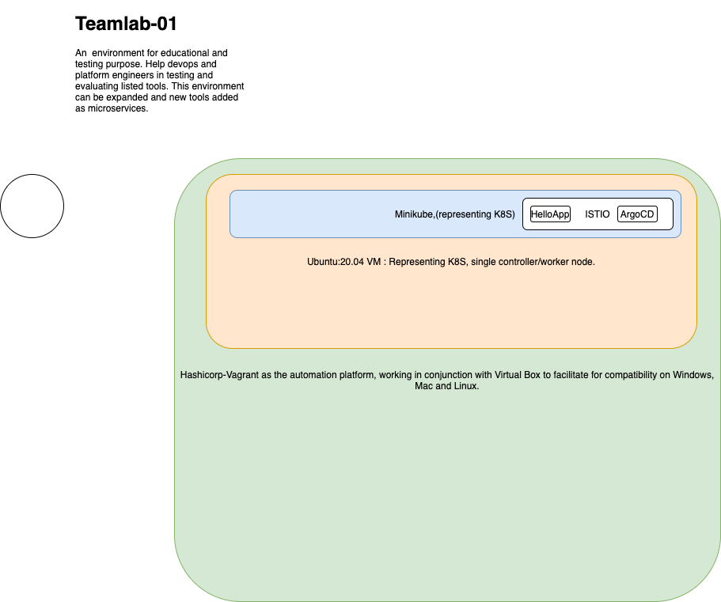

# Teamlab01

This environment is a Test environment for a integration & delivery system, one which is comprised of 'minikube representing K8S' , 'ISTIO', 'ELK', 'Prometheus', 'Argo-CD'. The system is portable, ideal target environment is a laptop or workstation that has 'Ubuntu/Linux, Mac, Windows'. One can run this on a VM based on a cloud provider of choice. if that is the case then one can skip the need for vagrant and go direct to installing 'minikube' on that VM.


The diagram below higlights the components invlolved in this lab.

 

### Details

##### Infrastructure part:
Comprised of Vagrant, VirtualBox for creating the node,( a Ubuntu 20.04 VM) which hosts Minikube, (the latter is representing the Kubernetes functionality) to be set on a (Ubuntu,Mac,Windows based laptop/Desktop), Can also be hosted on a cloud based VM, [GCP,Azure]. Adjustment need to be made here.

https://istio.io/latest/docs/setup/platform-setup/minikube/


One should use the tunnel method to expose Minikube services to the vm which hosts the minikube and istio. The laptop on which you operate can connect to the vm via RDP, this is the preferred way to VNC as its more feature rich and gives a better view of desktop apps.


Minikube-Features:
Minikube has many plugins, they need to be enabled to work, an example on that is listed below:

```
minikube addon enable dashboard
minikube addons enable istio
minikube addons enable helm-tiller
minikube addons enable ingress
minikube addons enable efk
minikube addons enable ingress-dns
minikube addons enable logviewer
minikube addons enable olm
minikube addons enable registry

```


https://istio.io/latest/docs/setup/getting-started/#download
Download latest version, for now this is ‘istio-1.10.2’

Change directory to that folder ‘istio-1.10.2’

One would find many components that would Bring in a wealth of material for learning and experimentations on ISTIO. The team or members can expand with that or adapt to the current environment as much as needed for the work stream.

##### Pipeline part:

By following this link, one would get a better idea of the argocd, its pointed out as a native tool for Kubernetes. Traditionally it jenkins was the defacto tool, later JenkinsX started to take the lead. That can still be added to this pipeline and there would be flexibility in changing the components around.
https://argoproj.github.io/argo-cd/getting_started/
